# 📚 BookManagement — отзывы и впечатления о книгах


> 🌟 Веб-приложение для публикации книжных впечатлений: можно делиться рассказами о книгах, оставлять отзывы, ставить лайки/дизлайки и собирать любимые истории в избранное.

## ✨ Возможности

- 📝 **Создавать рассказ** о прочитанной книге
- ✏️ **Редактировать рассказ** только автором
- 📚 **Смотреть список рассказов** — новые идут первыми
- 🔎 **Смотреть детали рассказа**
- 👍👎 **Лайкать / дизлайкать рассказ**
- 🗑️ **Удалять рассказ** только автором
- 💬 **Смотреть отзывы** под рассказом
- ✍️ **Писать отзывы**
- 🛠️ **Редактировать отзывы** только автором
- ❌ **Удалять отзывы** только автором
- ❤️ **Лайкать / дизлайкать отзыв**
- ⭐ **Добавлять и удалять рассказы из избранного**
- 🔐 **Регистрация и авторизация** через ASP.NET Identity
- 🚫 **Неавторизованные пользователи** не могут создавать рассказы, ставить оценки и писать отзывы

## 🛠️ Стек технологий

- **.NET 10** — платформа приложения
- **Blazor Interactive Server** — UI на Razor Components
- **ASP.NET Core Identity** — регистрация, вход и управление пользователями
- **Entity Framework Core** — доступ к данным и миграции
- **PostgreSQL** — основная база данных
- **MudBlazor** — UI-компоненты и стильный интерфейс
- **Npgsql** — провайдер PostgreSQL для EF Core

## 🧱 Архитектура проекта

Проект построен по понятной слоистой схеме:

```text
👤 Пользователь
   │
   ▼
🖥️ Components / Pages
   ├─ список рассказов
   ├─ детали рассказа
   ├─ избранное
   ├─ вход / регистрация
   └─ профиль
   │
   ▼
⚙️ Services
   ├─ StoryService
   ├─ ReviewService
   └─ UserService
   │
   ▼
🧱 Data
   ├─ ApplicationDbContext
   └─ DbInitializer
   │
   ├──────────────► 📦 Models
   │                 ├─ Story
   │                 ├─ Review
   │                 ├─ StoryLike / ReviewLike
   │                 └─ FavoriteStory
   │
   └──────────────► 🐘 PostgreSQL

🔐 Identity работает сквозным слоем: авторизация, роли, cookies и защита страниц.
```

### 🔁 Как движется запрос

1. Пользователь открывает страницу в `Components/Pages`.
2. Компонент обращается к сервису из `Services`.
3. Сервис работает через `ApplicationDbContext`.
4. Контекст использует сущности из `Models`.
5. Данные читаются и сохраняются в PostgreSQL.

### 📂 Основные папки

```text
Components/
  Pages/        — страницы приложения: рассказы, детали, избранное, вход, регистрация, профиль
  Shared/       — общие компоненты (например, карточка рассказа)
  Layout/       — общий макет интерфейса

Data/           — `ApplicationDbContext` и инициализация БД
Models/         — сущности предметной области
Services/       — бизнес-логика и работа с данными
Migrations/     — миграции Entity Framework Core
```

## 🚀 Быстрый запуск

### Вариант 1. Локально через .NET CLI

#### 1) Убедитесь, что установлено:
- .NET SDK 10
- PostgreSQL

#### 2) Подготовьте базу данных

В `appsettings.json` используется строка подключения по умолчанию:

```
Host=localhost;Port=5432;Database=bookdb;Username=postgres;Password=postgres
```

Создайте базу `bookdb`, если она ещё не создана.

#### 3) Запустите приложение

```powershell
dotnet restore
dotnet build
dotnet run
```

После запуска приложение обычно доступно по адресу:

- `http://localhost:5224`
- `https://localhost:7243`

### Вариант 2. Через Docker Compose 🐳

Проект уже содержит `Dockerfile` и `docker-compose.yaml`.

```powershell
docker compose up --build
```

После запуска:

- приложение будет доступно на `http://localhost:8000`
- PostgreSQL поднимется в контейнере `postgres`

Для Docker используется production-конфигурация:

```
Host=postgres;Port=5432;Database=bookdb;Username=postgres;Password=postgres
```

## 👤 Тестовые данные

При первом запуске база автоматически мигрируется и заполняется тестовыми данными.

### Примеры учётных записей

Пароль у всех демо-пользователей: `password123`

- `reader1`
- `booklover`
- `litfan`
- `critic`
- `bookworm`

## 🔐 Авторизация и права доступа

- 🔸 Гости могут только просматривать список и детали рассказов
- 🔸 Авторизованные пользователи могут создавать рассказы и отзывы, ставить лайки/дизлайки и добавлять в избранное
- 🔸 Редактировать и удалять записи может только их автор

## 🗂️ Основные страницы

- `/stories` — список рассказов
- `/stories/create` — создание нового рассказа
- `/stories/{id}` — детали рассказа и отзывы
- `/stories/{id}/edit` — редактирование рассказа
- `/favorites` — избранные рассказы
- `/login` — вход
- `/register` — регистрация
- `/profile` — профиль пользователя

## 🧩 Как это работает

1. Пользователь регистрируется или входит в систему.
2. Создаёт рассказ о книге с оценкой.
3. Другие пользователи читают рассказ, ставят лайки/дизлайки и пишут отзывы.
4. Автор может редактировать или удалять свои записи.
5. Любые понравившиеся рассказы можно добавить в избранное.

## 📝 Примечание

Проект использует автоматическое применение миграций при старте приложения, поэтому база данных обновляется сама после запуска.

---

## 📷 Интерфейс

### 🔐 Авторизация

| Вход | Регистрация |
|------|-------------|
| 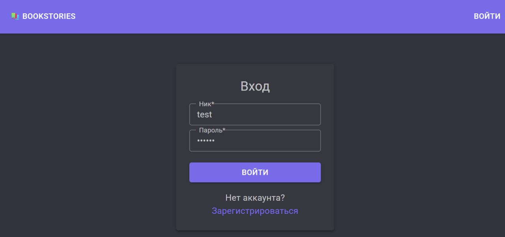 | 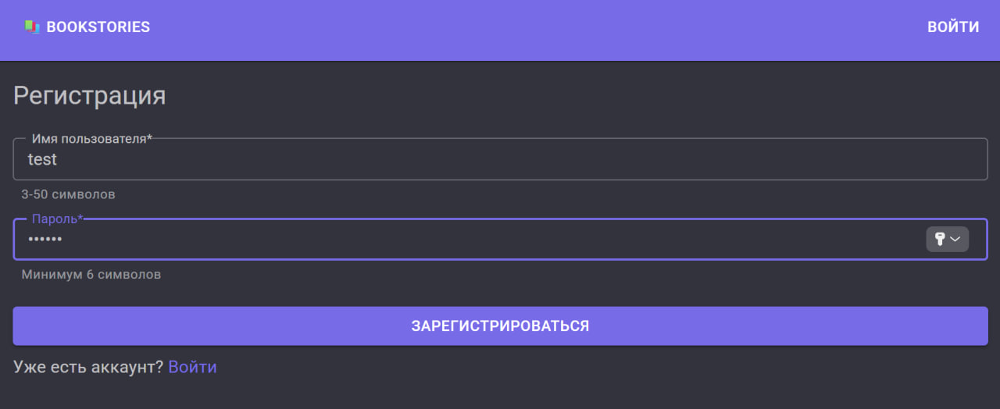 |

### 📚 Рассказы

<table>
<tr>
<td><b>Список рассказов</b><br>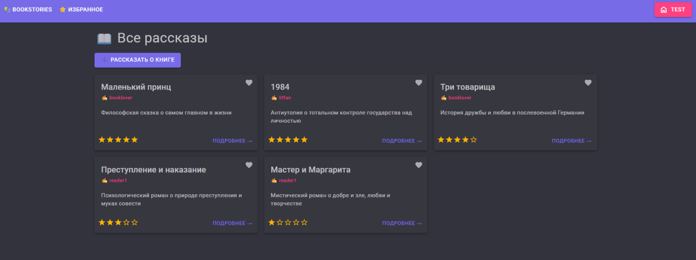</td>
<td><b>Детали рассказа (авторизованный)</b><br>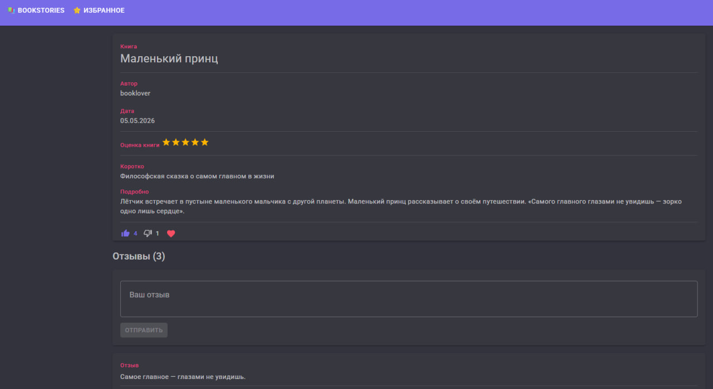</td>
</tr>
<tr>
<td><b>Детали рассказа (гость)</b><br>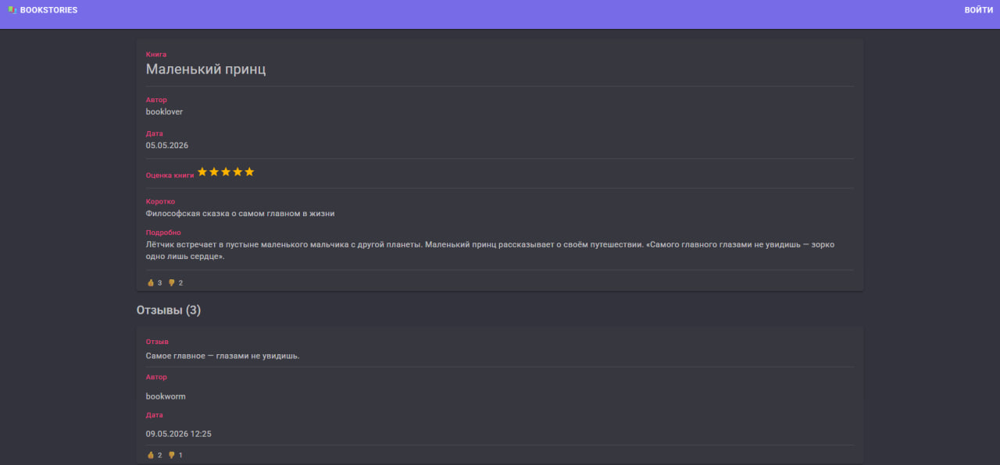</td>
<td><b>Создание рассказа</b><br>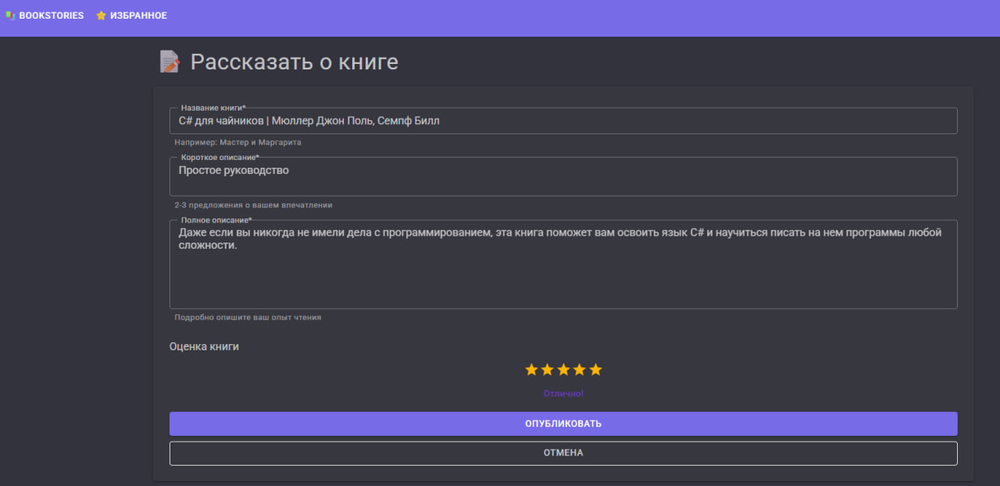</td>
</tr>
</table>

### ✏️ Редактирование и управление

<table>
<tr>
<td><b>Редактирование рассказа</b><br>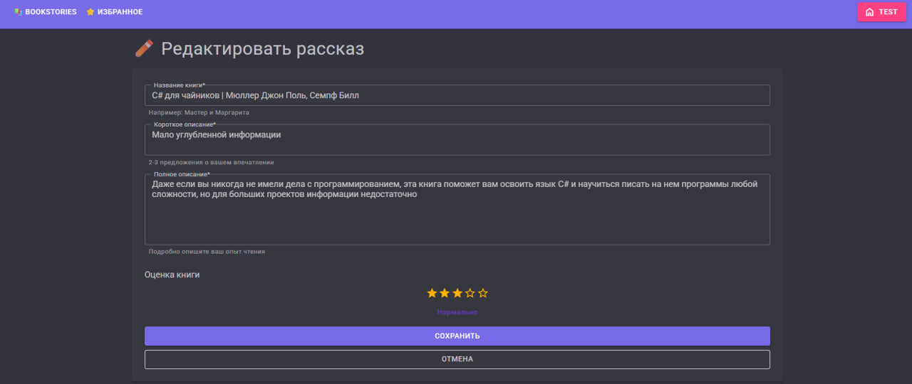</td>
<td><b>Меню управления</b><br>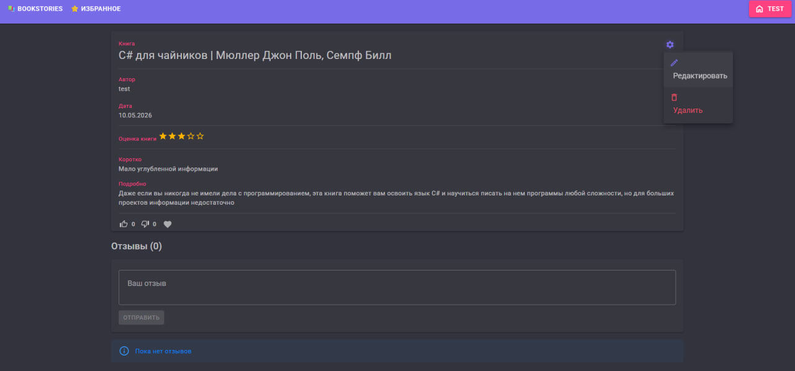</td>
</tr>
<tr>
<td><b>Подтверждение удаления</b><br>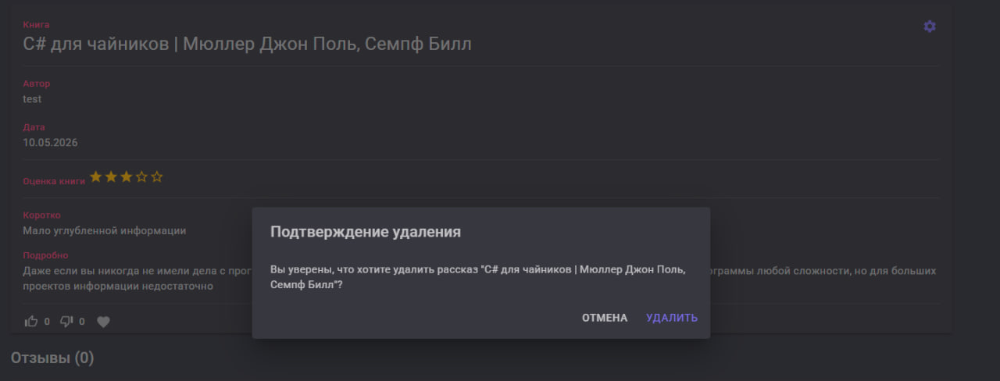</td>
<td><b>Добавление в избранное</b><br>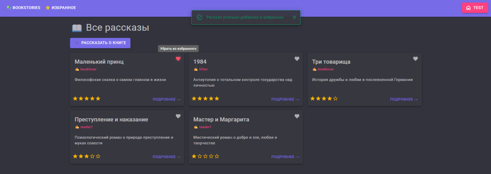</td>
</tr>
</table>

### 💬 Отзывы

<table>
<tr>
<td><b>Отзывы под рассказом</b><br>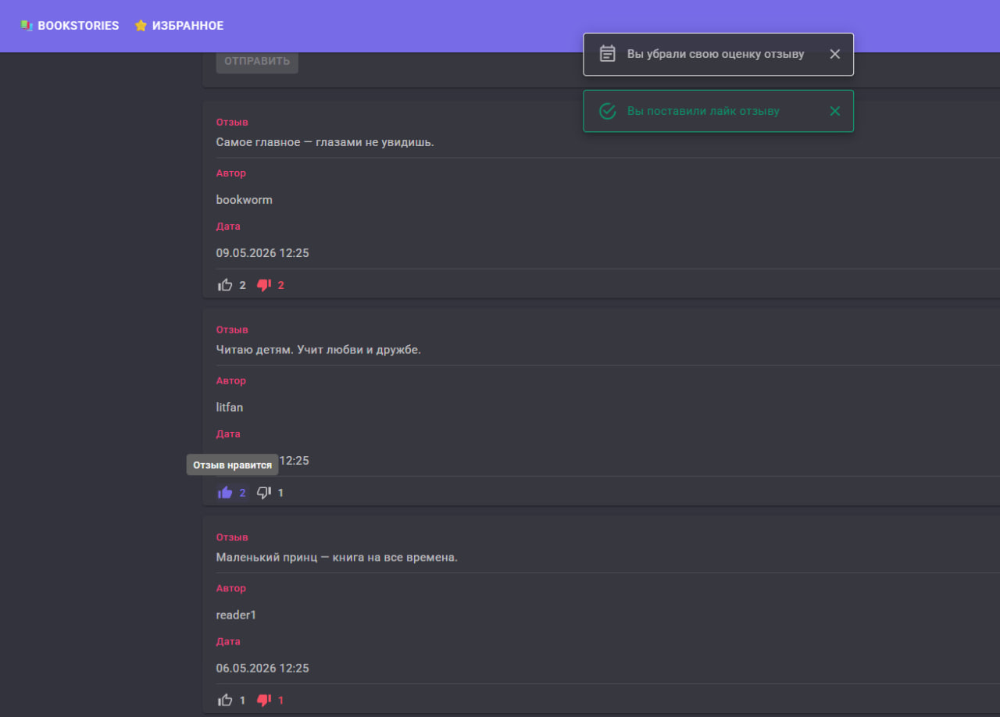</td>
<td><b>Редактирование отзыва</b><br>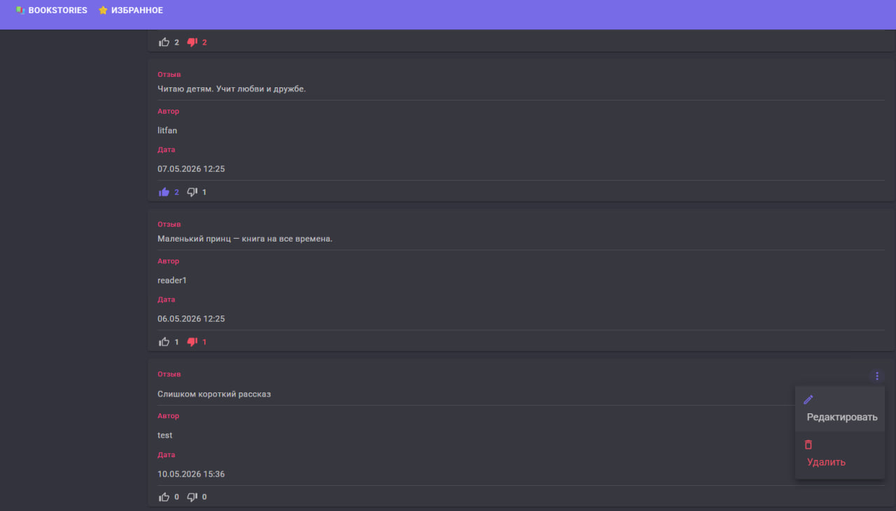</td>
</tr>
<tr>
<td><b>Сохранение изменений</b><br>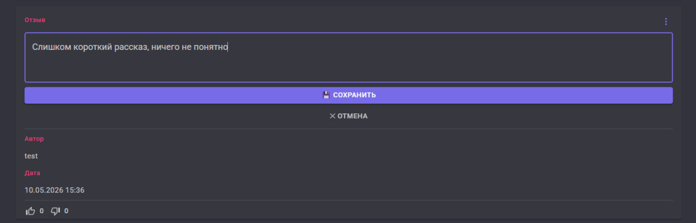</td>
<td><b>Подтверждение удаления отзыва</b><br>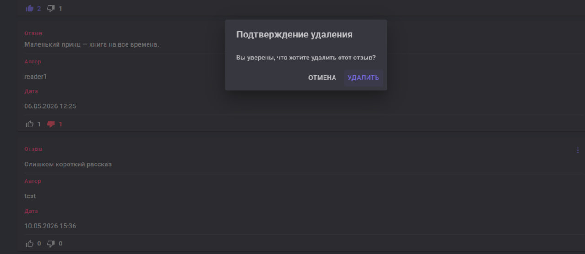</td>
</tr>
</table>

### ⭐ Избранное

| Страница избранного |
|-----|
| 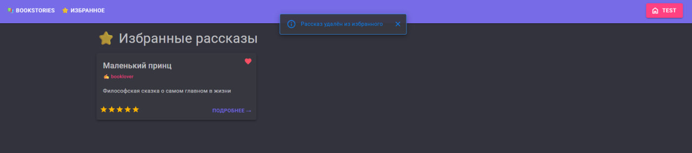 |

---

💜 Сделано с любовью к книгам, отзывам и хорошему интерфейсу.

